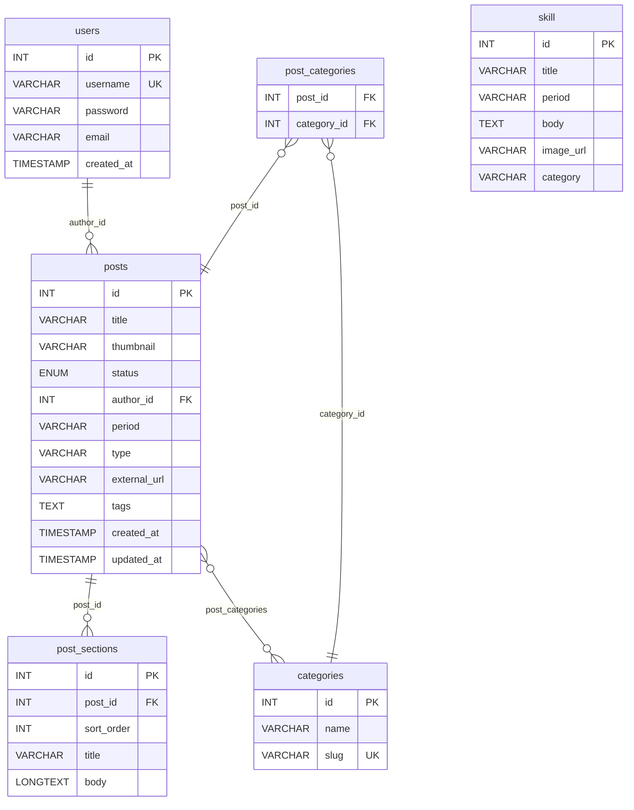

# ポートフォリオ CMS 設計書

> 作成日：2026-04-03
> 目的：PHPの学習を兼ねたポートフォリオ用CMS構築
> 環境：MAMP（Apache + PHP + MySQL） / phpMyAdmin

---

## 目次

1. [システム概要](#1-システム概要)
2. [環境・技術メモ](#2-環境技術メモ)
3. [ディレクトリ構成](#3-ディレクトリ構成)
4. [データベース設計](#4-データベース設計)
5. [画面一覧](#5-画面一覧)
6. [ファイル別の役割](#6-ファイル別の役割)
7. [SQL・PHP 用語メモ](#7-sqlphp-用語メモ)
8. [実装ログ](#8-実装ログ)

---

## 1. システム概要

### 機能一覧

| 機能 | 説明 | 状態 |
|------|------|------|
| ユーザー認証 | 管理者のログイン・ログアウト | ✅ 完了 |
| 記事投稿 | 記事の作成・編集・削除 | ✅ 完了 |
| 記事一覧 | 管理画面での記事一覧表示 | ✅ 完了 |
| カテゴリ管理 | カテゴリの作成・削除・記事への紐付け | ✅ 完了 |
| 画像アップロード | サムネイル画像のアップロード・保存 | ✅ 完了 |
| WYSIWYGエディタ | CKEditor 5 によるリッチテキスト入力 | ✅ 完了 |

### 開発ステップ

| Step | 内容 | 状態 |
|------|------|------|
| Step 1 | DB接続・設定ファイル（config.php） | ✅ 完了 |
| Step 2 | 管理者ユーザー登録・ログイン | ✅ 完了 |
| Step 3 | 記事一覧（管理画面トップ） | ✅ 完了 |
| Step 4 | 記事の投稿・編集・削除 | ✅ 完了 |
| Step 5 | カテゴリ管理・記事への紐付け | ✅ 完了 |
| Step 6 | 画像アップロード | ✅ 完了 |
| Step 7 | CKEditor 5 WYSIWYGエディタ導入 | ✅ 完了 |

---

## 2. 環境・技術メモ

### 開発環境

| 項目 | 内容 |
|------|------|
| ローカル環境 | MAMP（Mac） |
| Webサーバー | Apache |
| 言語 | PHP |
| DB | MySQL |
| DB管理ツール | phpMyAdmin |
| エディタ | VSCode |
| URL | `http://localhost:8888/myportfolio/` |

### 各ツールの役割

| ツール | 役割 | 例え |
|--------|------|------|
| MAMP | Apache・PHP・MySQLをまとめてインストール・起動する | 調理器具セット |
| Apache | ブラウザのリクエストを受け取りPHPに渡す | ウェイター |
| PHP | プログラムを処理してHTMLを生成する | 料理人 |
| MySQL | データを保存・管理する | 倉庫 |
| Homebrew | ソフトをインストールするための道具（今回は不使用） | Amazon |

### ローカル環境 vs レンタルサーバー

| | MAMP（ローカル） | レンタルサーバー（本番） |
|--|-----------------|------------------------|
| アクセス | 自分のMacの中だけ | 世界中からアクセス可能 |
| URL | `localhost:8888` | `https://example.com` |
| 費用 | 無料 | 月額数百円〜 |
| 用途 | 開発・テスト | 完成したサービスの公開 |

> **開発の流れ：** MAMPで開発・テスト → 完成したらレンタルサーバーにアップして公開

---

### ロリポップへの公開手順

#### 独自CMSの場合（このプロジェクト）

**Step 1：DBを作成する（サーバーパネル）**

```
ユーザー専用ページにログイン
→ サービス・契約 → データベース
→「データベースを追加する」
```

作成すると以下の情報が発行される：

| config.phpの定数 | 内容 |
|----------------|------|
| `DB_HOST` | `mysql**.lolipop.jp`（発行されたホスト名） |
| `DB_NAME` | `アカウント名_myportfolio` のような形式 |
| `DB_USER` | アカウント名と同じことが多い |
| `DB_PASS` | 作成時に自分で設定したパスワード |

**Step 2：phpMyAdminを開く**

```
「データベース」ページ → 作成したDBの横の「phpMyAdmin」ボタン
```

WordPressと違い、ロリポップが用意したphpMyAdminを使う。自分でインストールする必要はない。

**Step 3：テーブルをインポートする**

```
ローカルのphpMyAdmin → エクスポート → .sql ファイルを保存
         ↓
ロリポップのphpMyAdmin → インポート → その .sql ファイルを選択
```

テーブルの構造だけでなく、記事・カテゴリなどのデータも一緒にエクスポートできる。

**Step 4：ファイルをアップロードする（FTP）**

FTPソフト（FileZillaなど）でロリポップのサーバーにファイルを転送する。

```
myportfolio/ フォルダ全体をアップロード
（cms/uploads/ の画像ファイルも含む）
```

**Step 5：config.php の接続情報を書き換える**

```php
// ローカル（開発中）
define('DB_HOST', 'localhost');
define('DB_USER', 'root');
define('DB_PASS', 'root');

// 本番（ロリポップ）← Step 1 で発行された値に変える
define('DB_HOST', 'mysql**.lolipop.jp');
define('DB_NAME', 'アカウント名_myportfolio');
define('DB_USER', 'アカウント名');
define('DB_PASS', '設定したパスワード');
```

> ⚠️ `config.php` にはパスワードが書かれているため、GitHubなどに公開しないよう `.gitignore` に追加しておくこと。

---

#### WordPressとの比較

WordPressも同じPHP＋MySQLの仕組みだが、DB周りの作業の多くが自動化されている。

| 作業 | 独自CMS（このプロジェクト） | WordPress |
|------|--------------------------|-----------|
| テーブル作成 | 自分でSQLを書く | インストール時に自動で作られる |
| テーブルのエクスポート | phpMyAdminで手動 | プラグイン（All-in-One WP Migration など）で自動 |
| 接続情報の設定 | `config.php` を直接編集 | `wp-config.php` を編集（内容はほぼ同じ） |
| phpMyAdminへのアクセス | サーバーパネル経由 | サーバーパネル経由（同じ） |
| 画像の移行 | `uploads/` フォルダをFTPでそのまま転送 | プラグインで自動、または `wp-content/uploads/` をFTPで転送 |
| インストール作業 | なし（ファイルをアップするだけ） | ブラウザでインストール画面を実行する必要がある |

**WordPressの `wp-config.php`（参考）**

```php
// WordPressの接続設定ファイル。独自CMSのconfig.phpと役割は同じ
define( 'DB_NAME', 'データベース名' );
define( 'DB_USER', 'ユーザー名' );
define( 'DB_PASSWORD', 'パスワード' );
define( 'DB_HOST', 'localhost' );
```

`define()` の使い方もほぼ同じ。WordPressも内部は同じPHPの仕組みで動いている。

---

## 3. ディレクトリ構成

```
myportfolio/
├── index.html                  ポートフォリオTOP
├── single.html                 作品詳細ページ
│
└── cms/                        CMS本体
    ├── config.php              DB接続・共通関数（全ファイルからrequire）
    ├── login.php               ログイン画面
    ├── logout.php              ログアウト処理
    ├── setup.php               初回管理者ユーザー登録（使用後削除）
    │
    ├── admin/                  管理画面（ログイン必須）
    │   ├── index.php           記事一覧
    │   ├── post-new.php        記事新規作成
    │   ├── post-edit.php       記事編集
    │   └── categories.php      カテゴリ管理
    │
    └── uploads/                アップロード画像の保存先
```

---

## 3. データベース設計

### テーブル一覧

| テーブル名 | 役割 |
|-----------|------|
| users | 管理者のログイン情報 |
| posts | 記事のタイトル・サムネイル・メタ情報など |
| categories | カテゴリの一覧 |
| post_categories | 記事とカテゴリの紐付け（中間テーブル） |
| post_sections | 記事の本文セクション（見出し＋本文の繰り返し） |
| skill | スキルページ用データ |

---

### ER図（テーブル関係図）



> **記号の読み方：**
> - `||` ＝ 1件（必須）
> - `o{` ＝ 0件以上（任意・複数）
> - `}o--o{` ＝ 多対多（中間テーブル経由）

---

### users テーブル

管理者のログイン情報を管理する。

| カラム名 | 型 | 説明 |
|---------|-----|------|
| id | INT / PK / AUTO_INCREMENT | ユーザーID |
| username | VARCHAR(50) / UNIQUE | ログイン名 |
| password | VARCHAR(255) | ハッシュ化したパスワード |
| email | VARCHAR(100) | メールアドレス |
| created_at | TIMESTAMP | 作成日時 |

```sql
CREATE TABLE users (
    id INT AUTO_INCREMENT PRIMARY KEY,
    username VARCHAR(50) NOT NULL UNIQUE,
    password VARCHAR(255) NOT NULL,
    email VARCHAR(100),
    created_at TIMESTAMP DEFAULT CURRENT_TIMESTAMP
);
```

---

### posts テーブル

記事のメタ情報・サムネイルを管理する。本文は `post_sections` テーブルで別管理。`author_id` で users テーブルと紐付く。

| カラム名 | 型 | 説明 |
|---------|-----|------|
| id | INT / PK / AUTO_INCREMENT | 記事ID |
| title | VARCHAR(255) | タイトル |
| thumbnail | VARCHAR(255) | サムネイル画像のファイル名 |
| status | ENUM('draft','published') | 下書き or 公開 |
| author_id | INT / FK → users.id | 投稿者 |
| period | VARCHAR(100) | 制作期間（例：2025.06 – 08） |
| type | VARCHAR(100) | 種別（例：個人制作 / ブログサイト） |
| external_url | VARCHAR(2083) | 外部リンクURL（作品へのリンクなど） |
| tags | TEXT | 使用技術タグ（カンマ区切り 例：WordPress,SCSS） |
| created_at | TIMESTAMP | 作成日時 |
| updated_at | TIMESTAMP | 更新日時（自動更新） |

```sql
CREATE TABLE posts (
    id INT AUTO_INCREMENT PRIMARY KEY,
    title VARCHAR(255) NOT NULL,
    thumbnail VARCHAR(255),
    status ENUM('draft', 'published') DEFAULT 'draft',
    author_id INT,
    period VARCHAR(100),
    type VARCHAR(100),
    external_url VARCHAR(2083),
    tags TEXT,
    created_at TIMESTAMP DEFAULT CURRENT_TIMESTAMP,
    updated_at TIMESTAMP DEFAULT CURRENT_TIMESTAMP ON UPDATE CURRENT_TIMESTAMP,
    FOREIGN KEY (author_id) REFERENCES users(id)
);
```

> **2026-04-07 追加済み：** 以下のSQLで新カラムを追加・`content` を削除した。

```sql
ALTER TABLE posts ADD COLUMN period VARCHAR(100) DEFAULT NULL;
ALTER TABLE posts ADD COLUMN type VARCHAR(100) DEFAULT NULL;
ALTER TABLE posts ADD COLUMN external_url VARCHAR(2083) DEFAULT NULL;
ALTER TABLE posts ADD COLUMN tags TEXT DEFAULT NULL;
ALTER TABLE posts DROP COLUMN content;
```

---

### categories テーブル

カテゴリの一覧を管理する。

| カラム名 | 型 | 説明 |
|---------|-----|------|
| id | INT / PK / AUTO_INCREMENT | カテゴリID |
| name | VARCHAR(100) | カテゴリ名（例：JavaScript） |
| slug | VARCHAR(100) / UNIQUE | URL用スラッグ（例：javascript） |

```sql
CREATE TABLE categories (
    id INT AUTO_INCREMENT PRIMARY KEY,
    name VARCHAR(100) NOT NULL,
    slug VARCHAR(100) NOT NULL UNIQUE
);
```

---

### post_categories テーブル（中間テーブル）

記事とカテゴリの多対多の関係を管理する。
1つの記事が複数カテゴリを持てる。1つのカテゴリに複数記事が属せる。

| カラム名 | 型 | 説明 |
|---------|-----|------|
| post_id | INT / FK → posts.id | 記事ID |
| category_id | INT / FK → categories.id | カテゴリID |

```sql
CREATE TABLE post_categories (
    post_id INT,
    category_id INT,
    PRIMARY KEY (post_id, category_id),
    FOREIGN KEY (post_id) REFERENCES posts(id),
    FOREIGN KEY (category_id) REFERENCES categories(id)
);
```

**多対多の関係図：**
```
posts          post_categories     categories
-----          ---------------     ----------
id      ←───  post_id
               category_id  ───→  id
```

---

### post_sections テーブル

記事の本文セクションを管理する。1つの記事が複数のセクションを持てる（1対多）。
セクションは「見出し＋本文」の繰り返しで構成され、`sort_order` で表示順を制御する。

| カラム名 | 型 | 説明 |
|---------|-----|------|
| id | INT / PK / AUTO_INCREMENT | セクションID |
| post_id | INT / FK → posts.id | 紐付く記事のID |
| sort_order | INT | 表示順（0から始まる整数） |
| title | VARCHAR(255) | セクションの見出し |
| body | LONGTEXT | セクションの本文 |

```sql
CREATE TABLE post_sections (
    id INT AUTO_INCREMENT PRIMARY KEY,
    post_id INT NOT NULL,
    sort_order INT NOT NULL DEFAULT 0,
    title VARCHAR(255) NOT NULL,
    body LONGTEXT,
    FOREIGN KEY (post_id) REFERENCES posts(id)
);
```

**テーブルの関係図：**
```
posts (1) ─────── (多) post_sections
  id         ←─── post_id
```

**外部キー制約と削除順序：**

`post_sections.post_id` は `posts.id` を参照している（外部キー制約）。
このため、`posts` を削除する前に `post_sections` を先に削除しないと制約違反エラーになる。
`post_categories` も同様。

```php
// ❌ 間違った順序（posts を先に消そうとするとエラー）
// DELETE FROM posts WHERE id = :id → 1451 エラー

// ✅ 正しい順序（子テーブルから先に削除する）
DELETE FROM post_categories WHERE post_id = :id  // ① 中間テーブル
DELETE FROM post_sections  WHERE post_id = :id  // ② セクション
DELETE FROM posts          WHERE id = :id        // ③ 最後に記事本体
```

---

## 5. 画面一覧

| 画面名 | URL | ログイン必須 | 説明 |
|--------|-----|-------------|------|
| ログイン | /cms/login.php | 不要 | 管理者ログイン |
| 記事一覧 | /cms/admin/index.php | 必要 | 記事の一覧・削除 |
| 記事作成 | /cms/admin/post-new.php | 必要 | 新規記事の作成 |
| 記事編集 | /cms/admin/post-edit.php?id=1 | 必要 | 既存記事の編集 |
| カテゴリ管理 | /cms/admin/categories.php | 必要 | カテゴリの追加・削除 |

---

## 6. ファイル別の役割

### cms/config.php ✅

全ページから `require_once 'config.php'` で読み込む設定ファイル。

| 関数・定数 | 説明 |
|-----------|------|
| `DB_HOST` 他 | DB接続情報の定数 |
| `SITE_URL` | サイトのベースURL |
| `UPLOAD_DIR` | 画像保存先の絶対パス |
| `db()` | PDO接続を返す関数。同一リクエスト内で使い回す |
| `h($str)` | XSS対策のエスケープ関数 |
| `require_login()` | 未ログインならログイン画面へリダイレクト |

**学んだこと：**
- `define()` で定数を定義する
- `PDO` でDBに接続する
- `static` 変数で接続を使い回す
- `htmlspecialchars()` でXSS対策をする

**DB接続の仕組み（詳細）：**

`db()` 関数は3つのブロックで構成される。

**① 定数（接続情報）**

```php
define('DB_HOST', 'localhost'); // DBサーバーの場所（MAMPは自分のMac内なのでlocalhost）
define('DB_NAME', 'myportfolio'); // phpMyAdminで作ったDB名
define('DB_USER', 'root');     // MAMPのデフォルトユーザー
define('DB_PASS', 'root');     // MAMPのデフォルトパスワード
define('DB_CHARSET', 'utf8mb4'); // 日本語を含む全言語対応の文字コード
```

**② static変数で接続を使い回す**

通常の変数は関数が終わると消えるが、`static` をつけると次の呼び出し時も値が残る。

```php
// 通常の変数：毎回リセットされる
function test() {
    $count = 0;
    $count++;
    echo $count;
}
test(); // 1
test(); // 1（リセットされる）

// static変数：値が残る
function test() {
    static $count = 0;
    $count++;
    echo $count;
}
test(); // 1
test(); // 2（残っている）
```

`db()` では接続済みの `$pdo` を残すために使っている。

**③ if ($pdo === null) の中でやっていること**

```php
static $pdo = null;   // 最初は null（空）
if ($pdo === null) {  // null のときだけ中を実行（初回のみ）
    // DSNを作る
    $dsn = 'mysql:host=' . DB_HOST . ';dbname=' . DB_NAME . ';charset=' . DB_CHARSET;
    // DBに接続して $pdo に保存
    $pdo = new PDO($dsn, DB_USER, DB_PASS, $options);
}
return $pdo; // 接続済みオブジェクトを返す
```

```
1回目の呼び出し → $pdo が null → if の中を実行 → DBに接続 → $pdo に保存
2回目以降      → $pdo に値がある → if をスキップ → そのまま return
```

つまり「何度 `db()` を呼んでもDB接続は1回しか行わない」という効率的な設計。

**④ DSN（接続先を表す文字列）**

```
mysql:host=localhost;dbname=myportfolio;charset=utf8mb4
  ↑DB種別  ↑サーバー    ↑DB名              ↑文字コード
```

`new PDO()` に渡す「どのDBのどこに接続するか」をまとめた文字列。

**⑤ try〜catch**

「失敗するかもしれない処理」を `try` に書き、失敗したときの対処を `catch` に書く。

```php
try {
    // ここを試す（失敗するかもしれない処理）
    $pdo = new PDO($dsn, DB_USER, DB_PASS, $options);
} catch (PDOException $e) {
    // 失敗したときここが実行される
    exit('DB接続エラー: ' . $e->getMessage());
}
```

| 部分 | 意味 |
|------|------|
| `PDOException` | DB接続失敗時に発生するエラーの種類 |
| `$e` | 発生したエラーの情報が入る変数（慣習的に `$e` と書く） |
| `$e->getMessage()` | エラーの詳細メッセージを取り出す |
| `exit()` | メッセージを表示してPHPの実行を止める |

失敗するケース：DBが起動していない・パスワードが違う・DB名が違うなど。

JavaScriptにも同じ仕組みがある。書き方はほぼ同じで、`catch()` の中にエラーの種類を指定するかどうかが違う。

```javascript
// JavaScript
try {
    const res = await fetch('/api/data');
} catch (e) {
    console.log('エラー:', e.message);
}
```

**⑥ $options の3つの設定**

`[]` はPHPの配列。`キー => 値` の形で複数の設定をまとめて `new PDO()` に渡す。

```php
$options = [
    キー1 => 値1,
    キー2 => 値2,
    キー3 => 値3,
];
```

| オプション | 意味 |
|-----------|------|
| `ERRMODE_EXCEPTION` | SQLエラーを例外として発生させる。これがないとエラーを無視して処理が続いてしまう |
| `FETCH_ASSOC` | 取得結果を `$row['id']` のような連想配列で受け取る。設定しないとカラム名と番号の両方が入り冗長になる |
| `EMULATE_PREPARES => false` | 本物のプリペアドステートメントを使う。`false` にしないとSQLインジェクション対策が不完全になる |

`PDO::` はPDOクラスが持つ定数へのアクセス方法。値は内部的にただの数値だが、名前で書くことで意味が分かりやすくなる。

**使い方：**

```php
$pdo = db();
$stmt = $pdo->prepare('SELECT * FROM users WHERE id = :id');
$stmt->execute([':id' => 1]);
$user = $stmt->fetch();
```

---

**ヘルパー関数：h()**

XSS（クロスサイトスクリプティング）対策の関数。画面に値を出力するときに必ず使う。

XSSとは、フォームに `<script>` などを入力してページ上で実行させる攻撃。`htmlspecialchars()` でHTMLの特殊文字を無害な文字列に変換することで防ぐ。

```php
'<script>'  →  '&lt;script&gt;'  // ブラウザがタグとして認識しない
'"'         →  '&quot;'
"'"         →  '&#039;'
```

`h()` という短い名前にしているのは、出力のたびに毎回書くため。

```php
echo htmlspecialchars($user['username'], ENT_QUOTES, 'UTF-8'); // 長い
echo h($user['username']); // h() にまとめてシンプルに
```

`htmlspecialchars()` の引数：

```php
htmlspecialchars( $str,       ENT_QUOTES, 'UTF-8' )
//               ↑変換したい文字列 ↑変換モード  ↑文字コード
```

`ENT_QUOTES` はPHPが用意した定数（`PDO::ATTR_ERRMODE` と同じ種類）。どの文字を変換するかを指定する。

| 定数 | 変換対象 |
|------|---------|
| `ENT_COMPAT`（デフォルト） | `"` だけ変換。`'` は変換しない |
| `ENT_QUOTES` | `"` も `'` も両方変換 |
| `ENT_NOQUOTES` | どちらも変換しない |

`'` も攻撃に使われる可能性があるため `ENT_QUOTES` を使う。第3引数の `'UTF-8'` は文字コードの指定。日本語サイトでは必須。

---

**ヘルパー関数：require_login()**

管理画面ページの先頭で呼び出し、未ログインならログイン画面へ強制移動させる関数。

```php
require_login(); // これだけでログインチェック完了
```

中でやっていること：

① セッションが始まっていなければ開始する
```php
if (session_status() === PHP_SESSION_NONE) {
    session_start(); // セッションは使う前に開始が必要
}
```

`PHP_SESSION_NONE` はPHPが用意した定数。`session_status()` の戻り値と比較する。

| 定数 | 意味 |
|------|------|
| `PHP_SESSION_DISABLED` | セッション機能が無効 |
| `PHP_SESSION_NONE` | セッション未開始 |
| `PHP_SESSION_ACTIVE` | セッション開始済み |

実態はただの数値（0・1・2）だが、名前をつけることで意味が明確になる。`PDO::ATTR_ERRMODE` や `ENT_QUOTES` と同じ種類の定数。

② `$_SESSION['user_id']` が空なら未ログインと判断してリダイレクト
```php
if (empty($_SESSION['user_id'])) {
    header('Location: ' . SITE_URL . '/cms/login.php'); // リダイレクト先を指定
    exit; // 以降の処理を止める
}
```

---

**関数の型宣言**

```php
function h(string $str): string  // 引数が string、戻り値も string
function require_login(): void   // 戻り値なし（void）
```

引数と戻り値の型を明示することで、間違った使い方をしたときにエラーで気づける。JavaScriptにはない機能（TypeScriptにはある）。

---

### cms/setup.php ✅

管理者ユーザーを1人だけ登録する初回セットアップ画面。**使用後は削除すること。**

| 処理 | 説明 |
|------|------|
| `password_hash($password, PASSWORD_DEFAULT)` | パスワードをハッシュ化 |
| `INSERT INTO users ...` | プリペアドステートメントでDBに保存 |
| `SELECT COUNT(*) FROM users` | 既存ユーザーがいれば登録を拒否 |

---

### cms/login.php ✅

管理者のログインフォームと処理。

**なぜ `require_login()` を使わないのか**

`require_login()` は「未ログインならログイン画面へ飛ばす」関数。`login.php` でやりたいのは逆の「ログイン済みなら管理画面へ飛ばす」処理。`require_login()` を呼ぶと未ログインのユーザーが `login.php` に戻ってきて無限ループになる。

| ファイル | 目的 | 使う関数 |
|---------|------|---------|
| `admin/index.php` など | 未ログインを締め出す | `require_login()` |
| `login.php` | ログイン済みを管理画面へ誘導する | 手動でチェック |

| 処理 | 説明 |
|------|------|
| `SELECT * FROM users WHERE username = ?` | ユーザー名でDB検索 |
| `password_verify($password, $user['password'])` | 入力値とハッシュを照合 |
| `session_regenerate_id(true)` | セッションIDを再生成（ハイジャック対策） |
| `$_SESSION['user_id']` | ログイン情報をセッションに保存 |

---

### cms/logout.php ✅

ログアウト処理。セッションを完全に破棄する。

| 処理 | 説明 |
|------|------|
| `$_SESSION = []` | セッション変数をすべて削除 |
| `setcookie(session_name(), '', ...)` | ブラウザのセッションクッキーを削除 |
| `session_destroy()` | サーバー側のセッションデータを破棄 |

---

## 7. SQL・PHP 用語メモ

### SQL キーワード

**テーブル操作**

| キーワード | 意味 |
|-----------|------|
| `CREATE TABLE` | テーブルを新しく作る |
| `DROP TABLE` | テーブルを削除する |
| `ALTER TABLE` | テーブルの構造を変更する（カラム追加など） |

**データ操作（CRUD）**

| キーワード | 意味 | 用途 |
|-----------|------|------|
| `SELECT * FROM テーブル` | 全カラムを取得する | 一覧取得・詳細取得 |
| `SELECT COUNT(*) FROM テーブル` | 行数を数える | ユーザー存在チェックなど |
| `INSERT INTO テーブル (列) VALUES (値)` | 新しいレコードを追加する | 記事作成・ユーザー登録 |
| `UPDATE テーブル SET 列=値 WHERE 条件` | 既存レコードを更新する | 記事編集 |
| `DELETE FROM テーブル WHERE 条件` | レコードを削除する | 記事削除 |

**絞り込み・並び順**

| キーワード | 意味 |
|-----------|------|
| `WHERE 条件` | 条件に一致する行だけ取得する |
| `ORDER BY 列 DESC` | 指定した列で降順（新しい順）に並べる |
| `ORDER BY 列 ASC` | 指定した列で昇順（古い順）に並べる |
| `LIMIT n` | 取得する行数を最大n件に制限する |

**カラム定義**

| キーワード | 意味 |
|-----------|------|
| `INT` | 数値を入れる列 |
| `VARCHAR(n)` | 最大n文字のテキストを入れる列 |
| `LONGTEXT` | 長い文章を入れる列（記事本文など） |
| `TIMESTAMP` | 日時を入れる列 |
| `ENUM('a','b')` | 指定した値しか入れられない列 |
| `AUTO_INCREMENT` | 自動で 1, 2, 3... と番号を振る |
| `PRIMARY KEY` | その行を唯一識別するキー（重複・空欄不可） |
| `UNIQUE` | 同じ値を2つ登録できない |
| `NOT NULL` | 空欄禁止 |
| `DEFAULT 値` | 何も入れなければこの値が自動で入る |
| `ON UPDATE CURRENT_TIMESTAMP` | レコード更新のたびに現在日時が自動で入る |
| `FOREIGN KEY (列) REFERENCES テーブル(列)` | 別テーブルのデータと紐付ける |

### PRIMARY KEY の種類

| 種類 | 書き方 | 使う場面 |
|------|--------|---------|
| 通常 | `id INT PRIMARY KEY` | ほとんどのテーブル |
| 複合 | `PRIMARY KEY (post_id, category_id)` | 中間テーブル（組み合わせの重複を防ぐ） |

### テーブルの関係（リレーション）

```
users ──────── posts ─────── post_categories ──── categories
（1人）        （複数記事）    （中間テーブル）       （複数カテゴリ）

  1対多                           多対多
```

- **1対多**：1人のユーザーが複数の記事を書ける（`posts.author_id → users.id`）
- **多対多**：1つの記事が複数カテゴリに属せる。`post_categories` が橋渡しをする

### PHPの関数・定数の種類

| 種類 | 例 | 説明 |
|------|-----|------|
| PHPの組み込み関数 | `session_start()` `htmlspecialchars()` `header()` `empty()` `trim()` | PHPに最初から入っている。自分で定義せず使える |
| PHPの組み込み定数 | `PHP_SESSION_NONE` `ENT_QUOTES` `PASSWORD_DEFAULT` | PHPに最初から入っている定数 |
| クラスの定数 | `PDO::ATTR_ERRMODE` `PDO::FETCH_ASSOC` | PDOなどのクラスが持つ定数 |
| 自分で定義したもの | `db()` `h()` `require_login()` `DB_HOST` | config.phpで自分で作ったもの |

---

### PHP キーワード

**ファイル・定数**

| キーワード | 意味 |
|-----------|------|
| `define('KEY', 値)` | 定数を定義する（変更不可） |
| `require_once 'ファイル'` | 別ファイルを1回だけ読み込む（2回目以降は無視） |
| `__DIR__` | このファイルが置かれているディレクトリの絶対パス |

**制御構文**

| キーワード | 意味 |
|-----------|------|
| `if / elseif / else` | 条件分岐。HTMLに混在させるときは `:` と `endif` を使う |
| `foreach ($配列 as $値)` | 配列をループして1件ずつ処理する。HTMLに混在させるときは `:` と `endforeach` を使う |
| `exit` | その場でPHPの処理を止める |

PHPのみのコードとHTMLテンプレート内での書き方の違い：

```php
// PHPのみ（通常の書き方）
foreach ($categories as $category) {
    echo $category['name'];
}

if ($error !== '') {
    echo $error;
}

// HTMLテンプレート内（このプロジェクトで使っている書き方）
<?php foreach ($categories as $category): ?>
    <option><?= $category['name'] ?></option>
<?php endforeach; ?>

<?php if ($error !== ''): ?>
    <div class="error"><?= h($error) ?></div>
<?php endif; ?>
```

**演算子**

| キーワード | 意味 |
|-----------|------|
| `===` | 値と型が両方一致するか（厳密比較） |
| `!==` | 値または型が一致しないか |
| `??` | 左が null または未定義なら右を使う（null合体演算子）。JavaScriptと書き方が同じ |
| `\|\|` | どちらかが true なら true（OR） |
| `&&` | 両方が true なら true（AND） |
| `(int)` | 値を整数に強制変換するキャスト。`'abc'→0`、`'3'→3` |
| `?:` | 左が falsy（null・''・0・false）なら右を使う。`??` より広い条件で切り替わる |

**文字列・配列**

| キーワード | 意味 |
|-----------|------|
| `trim($str)` | 文字列の前後の空白・改行を除去する |
| `strlen($str)` | 文字列の長さ（バイト数）を返す |
| `empty($変数)` | 空文字・0・null・空配列・未定義なら true |

**DB接続・PDO**

| キーワード | 意味 |
|-----------|------|
| `PDO` | PHPからDBに接続するクラス |
| `new クラス名()` | クラスからオブジェクトを作る |
| `static $変数` | 関数内で値を保持し続ける（接続を使い回す） |
| `$pdo->prepare()` | SQLを準備してステートメントを返す |
| `$stmt->execute([])` | プレースホルダに値を渡してSQLを実行する |
| `$stmt->fetch()` | 結果を1行取得する。見つからなければ false |
| `$stmt->fetchAll()` | 結果を全行まとめて配列で取得する |
| `$stmt->fetchColumn()` | 結果の1列目の値だけ取得する（COUNT など） |

**パスワード・セッション**

| キーワード | 意味 |
|-----------|------|
| `password_hash()` | パスワードをハッシュ化して保存用文字列に変換 |
| `password_verify()` | 入力パスワードとハッシュが一致するか検証 |
| `session_start()` | セッションを開始する（使う前に必ず呼ぶ） |
| `session_regenerate_id(true)` | セッションIDを新しく作り直す（ハイジャック対策） |
| `session_destroy()` | サーバー側のセッションデータを完全に削除する |
| `$_SESSION['key']` | ページをまたいで値を保持するセッション変数 |

**文字列操作**

| キーワード | 意味 |
|-----------|------|
| `substr($str, 開始, 文字数)` | 文字列の一部を取り出す。`substr('2026-04-06 12:00:00', 0, 10)` → `'2026-04-06'` |
| `strtotime($str)` | `'2026-04-06 12:00:00'` のような日付文字列をUNIXタイムスタンプ（数値）に変換する |
| `date('フォーマット', $timestamp)` | タイムスタンプを指定した形式の文字列に変換する |

`date()` のフォーマット文字：

| 文字 | 意味 | 例 |
|------|------|----|
| `Y` | 4桁の年 | `2026` |
| `n` | 月（ゼロ埋めなし） | `4` |
| `j` | 日（ゼロ埋めなし） | `6` |
| `m` | 月（ゼロ埋めあり） | `04` |
| `d` | 日（ゼロ埋めあり） | `06` |

```php
// 使い方
$date = date('Y年n月j日', strtotime($post['created_at']));
// '2026-04-06 12:00:00' → '2026年4月6日'
```

---

**その他の組み込み関数**

| キーワード | 意味 |
|-----------|------|
| `htmlspecialchars()` | HTMLタグを無害化（XSS対策） |
| `header('Location: url')` | 別URLへリダイレクトする |
| `time()` | 現在時刻をUNIXタイムスタンプ（数値）で返す |
| `ini_get('設定名')` | PHPの設定値を取得する |
| `session_get_cookie_params()` | セッションクッキーの設定情報を取得する |
| `session_name()` | セッション名を取得する（デフォルトは `PHPSESSID`） |
| `setcookie()` | ブラウザのクッキーを操作する |

**配列操作**

| キーワード | 意味 |
|-----------|------|
| `array_column($配列, 'キー名')` | 配列から特定のキーの値だけ取り出してフラットな配列を作る |
| `explode('区切り文字', $str)` | 文字列を区切り文字で分割して配列にする。JSの `split()` に相当 |

```php
$rows = [['category_id' => 2], ['category_id' => 5]];
array_column($rows, 'category_id'); // → [2, 5]

// explode() の使い方
$tags = explode(',', 'WordPress,SCSS,JavaScript');
// → ['WordPress', 'SCSS', 'JavaScript']

// single.php / index.php でのタグ表示
$tags = !empty($post['tags']) ? explode(',', $post['tags']) : [];
foreach ($tags as $tag) {
    echo '<span class="tag">' . h(trim($tag)) . '</span>';
}
```

---

**文字列 → HTML変換**

| キーワード | 意味 |
|-----------|------|
| `nl2br($str)` | 文字列中の改行（`\n`）を `<br>` タグに変換する。テキストエリアの入力を改行ありで表示するときに使う |

```php
// 使い方（必ずh()でエスケープしてからnl2br()を適用する）
echo nl2br(h($section['body']));
// ↑ ① h() でXSS対策（特殊文字を無害化）
// ② nl2br() で改行を <br> に変換（h()の後に呼ばないと <br> も文字列になってしまう）
```

**注意：順序が重要**
```php
// ❌ 間違い：nl2br を先にかけると <br> タグが h() でエスケープされてしまう
echo h(nl2br($text)); // → &lt;br&gt; と表示されてしまう

// ✅ 正しい順序
echo nl2br(h($text)); // → <br> タグとして機能する
```

---

**フォームの配列送信（セクション管理で使用）**

`name="field[]"` のように `[]` をつけると、複数のinput/textareaの値をPHPで配列として受け取れる。

```html
<!-- HTMLフォーム -->
<input type="text" name="section_title[]" value="概要">
<input type="text" name="section_title[]" value="工夫した点">
<textarea name="section_body[]">説明1</textarea>
<textarea name="section_body[]">説明2</textarea>
```

```php
// PHP側での受け取り
$_POST['section_title'] // → ['概要', '工夫した点']
$_POST['section_body']  // → ['説明1', '説明2']

// インデックスが対応しているのでループして紐付けられる
foreach ($_POST['section_title'] as $i => $title) {
    $body = $_POST['section_body'][$i] ?? '';
}
```

---

**画像アップロード関連**

| キーワード | 意味 |
|-----------|------|
| `strtolower($str)` | 文字列をすべて小文字に変換する。`'JPG'→'jpg'` |
| `pathinfo($path, PATHINFO_EXTENSION)` | ファイルパスから拡張子だけ取り出す |
| `in_array($値, $配列)` | 配列に値が含まれるか調べる。JSの `Array.includes()` に相当 |
| `uniqid()` | 現在時刻をもとにユニークなIDを生成する。ファイル名の重複防止に使う |
| `move_uploaded_file($tmp, $dest)` | 一時フォルダのアップロードファイルを指定場所に移動して永続保存する |
| `file_exists($path)` | ファイルが存在するか確認する。削除前の存在確認に使う |
| `unlink($path)` | ファイルを削除する |

アップロードの流れ：
```
ブラウザ → サーバーの一時フォルダ（/tmp/phpXXXXXX）
                ↓ move_uploaded_file()
           cms/uploads/67f2a1b3.jpg  ← 永続保存
```

`move_uploaded_file()` は「ファイルを移動する」と「成功/失敗を返す」を同時に行う。`if (move_uploaded_file(...))` で実行しながら結果を判定するパターン。

```php
if (move_uploaded_file($file['tmp_name'], $savePath)) {
    // 成功：$savePath にファイルが移動済み
} else {
    // 失敗：権限エラーなど
}
```

PHPでは `if (関数())` の形で「実行しながら結果を判定する」パターンがよく使われる。

### session_start()

セッションを開始する関数。これを呼ぶと `$_SESSION` が使えるようになる。ページの先頭（HTML出力より前）で呼ぶ必要がある。

**セッションとは**、ページをまたいでデータを保持する仕組み。HTTPは本来「1リクエストごとに独立」しているため、何もしないとページ移動のたびにログイン状態が消える。セッションはサーバー側にデータを保存し、クッキーのIDで紐付けることでこれを解決する。

```
ブラウザ            サーバー
  ↕ クッキー(ID)    ↕ $_SESSION のデータ
  PHPSESSID=abc     abc → ['user_id'=>1, 'username'=>'suzuki']
```

---

### htmlspecialchars()

HTMLの特殊文字を無害な文字列に変換する関数。DBや `$_POST` の値を画面に出力するときは必ず使う（`h()` 関数の中で呼んでいる）。

| 元の文字 | 変換後 |
|---------|--------|
| `<` | `&lt;` |
| `>` | `&gt;` |
| `"` | `&quot;` |
| `'` | `&#039;` |
| `&` | `&amp;` |

---

### header()

ブラウザへHTTPヘッダーを送る関数。`Location:` でリダイレクトに使うことが多い。

```php
header('Location: /cms/login.php');
exit; // 必ずセットで書く。ないと後続の処理も実行される
```

**注意**：HTMLを1文字でも出力した後に呼ぶとエラー。ヘッダーはHTMLより先に送る必要がある。このプロジェクトでは `<?php ?>` ブロック内でフォーム処理を先に行いリダイレクトしているため問題ない。

---

### trim()

文字列の前後の空白・タブ・改行を取り除く関数。中央の空白は取り除かれない。

```php
trim('  suzuki  ')  // → 'suzuki'
trim("\n hello\t")  // → 'hello'
trim('hello world') // → 'hello world'（中の空白はそのまま）
```

フォーム入力値に使う。ユーザーが誤って空白を入力してもバリデーションが正しく機能する。

```php
$name = trim($_POST['name'] ?? '');
if ($name === '') { // trim後に空なら本当に何も入力していない }
```

---

### empty() と !empty()

`empty()` は変数が「空」かどうかを調べる組み込み関数。空文字・0・null・空配列・未定義をすべて「空」と判定する。変数が存在しなくてもエラーにならない点が特徴。

```php
empty('')       // true：空文字
empty(null)     // true：null
empty(0)        // true：数値の0
empty('0')      // true：文字列の0
empty([])       // true：空配列
empty($未定義)  // true：未定義の変数（エラーにならない）
empty('hello')  // false：値がある
```

`isset()` との違い：

```php
isset($x)  // 変数が存在してnullでなければ true
empty($x)  // 変数が空・偽っぽい値なら true（isset の逆に近い）
```

`!empty()` は「空でない＝値が送られてきた」の確認に使う。フォーム値は文字列で届くため `=== true` では一致しない。

```php
$_POST['delete_id'] = '3'; // フォームから届く値は文字列

'3' === true   // false（型が違う）
!empty('3')    // true（値があるので空でない）← こちらを使う
```

---

### type="hidden"

画面に表示されないinput。ユーザーには見えないが、フォーム送信時に値を一緒に送れる。

```html
<input type="hidden" name="delete_id" value="3">
```

`name` はフォームの入力欄に付けた名前で、PHPで `$_POST['delete_id']` として受け取るためのキー。DBのカラム名とは無関係で自由に決められる。

```
DBの posts.id = 3
    ↓ HTMLに埋め込む
<input type="hidden" name="delete_id" value="3">
    ↓ POST送信
$_POST['delete_id'] = '3'
    ↓ PHPで使う
DELETE FROM posts WHERE id = :id  ← ここで初めてDBのidと紐づく
```

---

### スーパーグローバル変数

PHPが自動的に用意する特別な変数。どのファイル・どの関数の中からでも使える（`global` 宣言不要）。

| 変数 | 中身 | 主な用途 |
|------|------|----------|
| `$_SERVER` | サーバー・リクエストの情報 | リクエストメソッド判定、IPアドレス取得など |
| `$_POST` | フォームのPOST送信値 | フォーム送信の受け取り |
| `$_GET` | URLの `?key=value` の値 | ページネーション、ID指定など |
| `$_SESSION` | セッション変数（ログイン情報など） | ログイン状態の保持 |
| `$_FILES` | アップロードされたファイルの情報 | 画像・ファイルアップロード処理 |
| `$_COOKIE` | ブラウザのクッキー値 | 「次回もログイン状態を保持」など |
| `$_REQUEST` | `$_GET` + `$_POST` + `$_COOKIE` の統合 | メソッドを問わず値を取得（セキュリティ上 `$_POST`/`$_GET` を直接使う方が推奨） |
| `$_ENV` | サーバーの環境変数 | パスワードや秘密情報の外部管理 |
| `$GLOBALS` | スクリプト内のすべてのグローバル変数 | 関数の中からグローバル変数を参照・変更 |

#### よく使う `$_SERVER` のキー

| キー | 値の例 | 意味 |
|------|--------|------|
| `$_SERVER['REQUEST_METHOD']` | `'GET'` / `'POST'` | アクセス方法 |
| `$_SERVER['PHP_SELF']` | `'/cms/admin/index.php'` | 現在のファイルパス |
| `$_SERVER['QUERY_STRING']` | `'id=3&tab=edit'` | URLの `?` 以降の文字列 |
| `$_SERVER['REMOTE_ADDR']` | `'127.0.0.1'` | アクセス元のIPアドレス |
| `$_SERVER['HTTP_HOST']` | `'localhost:8888'` | ホスト名 |

`$_SERVER['REQUEST_METHOD']` はブラウザがどの方法でアクセスしてきたかを表す。

```
URLを直接開く・リンクをクリック → 'GET'
フォームのsubmitボタンを押す   → 'POST'
```

```php
if ($_SERVER['REQUEST_METHOD'] === 'POST') {
    // フォームが送信されたときだけ実行する処理
}
```

#### `$_SESSION` の使い方

```php
session_start(); // ファイルの先頭で必ず呼ぶ（セッション開始）

// 値をセット
$_SESSION['user_id'] = $user['id'];

// 値を取得
$userId = $_SESSION['user_id'];

// セッション破棄（ログアウト）
$_SESSION = [];
session_destroy();
```

#### `$_COOKIE` の使い方

```php
// クッキーをセット（有効期限：1週間）
setcookie('remember_token', $token, time() + 60 * 60 * 24 * 7, '/');

// クッキーを取得
$token = $_COOKIE['remember_token'] ?? null;

// クッキーを削除（有効期限を過去にする）
setcookie('remember_token', '', time() - 3600, '/');
```

> **セキュリティ注意：** `$_GET` / `$_POST` / `$_COOKIE` から取得した値はユーザーが自由に改ざんできる。DBに渡す際はプリペアドステートメント、画面に出力する際は `htmlspecialchars()` で必ずエスケープする。

---

### GET と POST

| | GET | POST |
|--|-----|------|
| 用途 | ページの表示・取得 | データの送信・更新・削除 |
| 値の場所 | URLの `?id=1` | リクエストの中（URLに見えない） |
| PHPでの取得 | `$_GET['id']` | `$_POST['title']` |

`post-edit.php` は同じファイルが2役をこなす：

```
GETでアクセス（?id=1）
→ DBから記事を取得してフォームに表示

フォームを送信（type="submit"のボタンを押す）
→ 同じURL（post-edit.php?id=1）にPOSTで送信
→ $_SERVER['REQUEST_METHOD'] === 'POST' が true
→ UPDATE 実行 → 一覧へリダイレクト
```

`<form>` の `action` を省略すると自分自身のURLに送信される。

---

### header()

HTTPレスポンスヘッダーをブラウザへ送る組み込み関数。用途はリダイレクトだけではない。

```php
header('Location: /cms/admin/index.php'); // リダイレクト（別ページへ飛ばす）
header('Content-Type: application/json'); // JSONを返すことを伝える
header('HTTP/1.1 404 Not Found');         // 404エラーを返す
```

`Location:` はHTTPの仕様で「このURLへ移動してください」という意味。PHPが送るとブラウザが自動的にそのURLへ移動する。

**exit が必ず必要な理由：**

`header()` はブラウザへ命令を送るだけでPHPの処理は止まらない。`exit` がないと後ろのコードも実行され続ける。

```php
header('Location: /cms/login.php');
exit; // ← これがないと以降の処理も実行されてしまう
```

---

### デバッグ用関数

変数の中身を確認するための関数。確認が終わったら必ず削除する（本番環境に残すと内部情報が丸見えになる）。

| 関数 | 用途 |
|------|------|
| `var_dump($変数)` | 型・値・構造をすべて表示。配列やオブジェクトの中身確認に最適 |
| `print_r($変数)` | 配列の中身を読みやすく表示。型は表示されない |
| `echo $変数` | 単純な文字列・数値の確認 |

```php
var_dump($_FILES); // アップロードファイルの中身を確認
var_dump($_POST);  // フォームの送信値を確認
var_dump($user);   // DBから取得した1行を確認
exit;              // 確認したらここで止める
```

---

### echo（出力）

画面（ブラウザ）に文字を出力する命令。

```php
echo 'こんにちは';          // こんにちは
echo $name;                // 変数の中身を出力
echo 'Hello ' . $name;    // . で文字列をつなげる
echo '<p>HTMLも書ける</p>'; // HTMLタグもそのまま出力される
```

**JavaScriptとの比較：**

| | PHP | JavaScript |
|--|-----|-----------|
| 出力命令 | `echo '文字';` | `console.log('文字')` |
| 表示場所 | ブラウザのページ上に直接表示 | ブラウザの開発者ツール（コンソール）のみ |

---

### プリペアドステートメント

SQLと値を**別々に送る**仕組み。SQLインジェクション対策の核心。

**普通のSQL（危険）：**
```php
// ユーザーの入力をそのままSQLに埋め込む
$pdo->query("SELECT * FROM users WHERE username = '$username'");

// $username に「' OR '1'='1」を入れられると…
// → WHERE username = '' OR '1'='1'  ← 全件取得されてしまう
```

**プリペアドステートメント（安全）：**
```php
$stmt = $pdo->prepare('SELECT * FROM users WHERE username = :username');
// ① :username はプレースホルダ（穴）。まだ値は入っていない

$stmt->execute([':username' => $username]);
// ② 値だけ別に送る。値はSQLの命令として解釈されない
```

プレースホルダは名前付き（`:username`）と `?` の2種類。名前付きが読みやすい。

```php
// 名前付き（このプロジェクトで使用）
$stmt->execute([':id' => $id, ':title' => $title]);

// ? を使う書き方（順番で対応）
$stmt = $pdo->prepare('SELECT * FROM users WHERE id = ?');
$stmt->execute([$id]);
```

---

### prepare() と execute()

セットで使うPDOのメソッド。SQLインジェクション対策のために2段階に分ける。

```php
$stmt = $pdo->prepare('SELECT * FROM users WHERE username = :username');
// ↑ :username はプレースホルダ（値の穴）。まだ値は入っていない

$stmt->execute([':username' => $username]);
// ↑ プレースホルダに実際の値を渡して実行
```

**なぜ2段階に分けるのか：**

```php
// 危険：ユーザーの入力をSQLに直接埋め込む
$pdo->query("SELECT * FROM users WHERE username = '$username'");
// $username に "' OR '1'='1" などを入れられると全件取得されてしまう

// 安全：prepare → execute で分ける
$stmt = $pdo->prepare('SELECT * FROM users WHERE username = :username');
$stmt->execute([':username' => $username]);
// 値がどんな文字列でもSQLの命令として解釈されない
```

```
prepare()  → MySQLに「このSQL構造を使う」と伝える
execute()  → MySQLに「この値で実行して」と値だけ送る（値は命令として解釈されない）
```

---

### -> と => の違い

| 記号 | 用途 | JavaScript相当 |
|------|------|---------------|
| `->` | オブジェクトのメソッド・プロパティ呼び出し | `.`（ドット） |
| `=>` | 配列のキーと値の対応 | `:`（コロン） |

```php
// -> オブジェクトのメソッドを呼ぶ
$pdo->prepare(...);   // $pdo オブジェクトの prepare を呼ぶ
$e->getMessage();     // $e オブジェクトの getMessage を呼ぶ

// => 配列のキーと値を対応させる
$options = ['name' => 'suzuki'];          // キー: 'name'、値: 'suzuki'
$stmt->execute([':username' => $username]); // プレースホルダ: 実際の値
```

---

### 型（データの種類）

PHPの主な型一覧：

| 型 | 意味 | 例 |
|----|------|----|
| `string` | 文字列 | `'hello'` `'suzuki'` |
| `int` | 整数 | `1` `25` `-3` |
| `float` | 小数 | `3.14` |
| `bool` | 真偽値 | `true` / `false` |
| `array` | 配列 | `['a', 'b']` |
| `null` | 空 | `null` |

関数の引数・戻り値に型を指定できる（必須ではないが書くと安全）：

```php
function h(string $str): string { ... }
//          ↑引数はstring    ↑戻り値もstring

function require_login(): void { ... }
//                         ↑戻り値なし
```

JavaScriptは型の指定がないが、TypeScriptはPHPに近い書き方になる：

```typescript
function h(str: string): string { ... } // TypeScript
```

---

### 変数と定数

PHPの変数は必ず `$` から始める。型の宣言は不要。

```php
$name = 'suzuki';  // 文字列
$age  = 25;        // 数値
$flag = true;      // 真偽値
```

`define()` で作った**定数**は `$` なしで使う。

```php
define('SITE_URL', 'http://localhost:8888');

echo $name;    // 変数：$あり
echo SITE_URL; // 定数：$なし
```

`config.php` の `DB_HOST` などが `$` なしなのはこのため。

**他の言語との比較：**

| 言語 | 変数宣言 |
|------|---------|
| PHP | `$name = 'suzuki';` |
| JavaScript | `let name = 'suzuki';` |
| Python | `name = 'suzuki'` |
| Java | `String name = "suzuki";` |

### JavaScript DOM操作（セクション管理画面）

`post-edit.php` のセクション追加・削除ボタンで使っているDOM操作のまとめ。

**セクション追加（`addSection()`）**

```javascript
function addSection() {
    const wrap = document.getElementById('sections-wrap'); // 親要素を取得
    const block = document.createElement('div');           // 新しい div 要素を作成
    block.className = 'section-block';                     // クラスを設定
    block.innerHTML = `
        <button type="button" onclick="deleteSection(this)">削除</button>
        <input type="text" name="section_title[]">
        <textarea name="section_body[]"></textarea>
    `;
    wrap.appendChild(block); // 親要素の末尾に追加
}
```

| メソッド | 意味 |
|---------|------|
| `document.getElementById('id')` | IDで要素を取得する |
| `document.createElement('タグ名')` | 新しいHTML要素を生成する（まだDOMには追加されない） |
| `element.className = '...'` | 要素にクラスを設定する |
| `element.innerHTML = '...'` | 要素の中身をHTMLで設定する |
| `親.appendChild(子)` | 親要素の末尾に子要素を追加する |

**セクション削除（`deleteSection()`）**

```javascript
function deleteSection(btn) {
    btn.closest('.section-block').remove();
    // btn      = クリックされた削除ボタン自身（this で渡される）
    // closest() = 自身または祖先の中で最初に条件に一致する要素を返す
    // remove()  = 要素をDOMから削除する
}
```

| メソッド | 意味 |
|---------|------|
| `element.closest('セレクタ')` | 自身と祖先要素を上に向かって探し、最初に一致する要素を返す。JSの `querySelector` の逆方向版 |
| `element.remove()` | 要素をDOMから削除する。PHPの `unlink()` のDOM版 |

**`this` でボタン自身を渡す**

```html
<button onclick="deleteSection(this)">削除</button>
```

`onclick="deleteSection(this)"` の `this` はクリックされたボタン要素自身を指す。関数内で `btn` として受け取り、そこから `closest()` で親の `.section-block` を探す。

---

### セキュリティ対策まとめ

| 脅威 | 対策 | 実装 |
|------|------|------|
| SQLインジェクション | プリペアドステートメント | `$pdo->prepare()` + `execute()` |
| XSS | 出力エスケープ | `h()` 関数（`htmlspecialchars()`） |
| パスワード漏洩 | ハッシュ化 | `password_hash()` / `password_verify()` |
| セッションハイジャック | セッションID再生成 | `session_regenerate_id(true)` |
| 不正アクセス | ログインチェック | `require_login()` 関数 |

---

## 8. 実装ログ

### 2026-04-03 Step 0 完了：環境構築・DB作成

- MAMP インストール・起動確認
- phpMyAdmin で `myportfolio` データベース作成
- 4テーブル作成：`users` / `posts` / `categories` / `post_categories`
- `test.php` で PHP の動作確認
- 不要なテーブルを `DROP TABLE` で削除

### 2026-04-03 Step 1 完了：DB接続・設定ファイル

- `cms/config.php` 作成
- `cms/test-db.php` でDB接続確認 → `DB接続成功！ usersテーブルのレコード数: 0`
- DB接続：PDO使用、エラーは例外で検知

### 2026-04-03 Step 2 完了：管理者ユーザー登録・ログイン

- `cms/setup.php` 作成：フォームから管理者を1人だけ登録できる初回セットアップ画面
  - `password_hash()` でパスワードをハッシュ化してDBに保存
  - 既にユーザーが存在する場合は登録を拒否（2人目を防ぐ）
  - 登録後はファイルを削除する必要あり
- `cms/login.php` 作成：ログインフォーム + 処理
  - `password_verify()` でハッシュと照合
  - `session_regenerate_id(true)` でセッションハイジャック対策
  - `$_SESSION['user_id']` / `$_SESSION['username']` にログイン情報を保存
  - エラーは「ユーザー名またはパスワードが正しくありません」と統一（情報漏洩防止）
- `cms/logout.php` 作成：セッション変数削除 → クッキー削除 → `session_destroy()`
- `cms/admin/index.php` 作成：管理画面の仮トップページ（Step 3 で本実装）
- `cms/admin/` / `cms/uploads/` ディレクトリ作成

**学んだこと：**
- `password_hash()` は同じパスワードでも毎回違うハッシュを生成する（ソルト自動付与）
- `password_verify($入力値, $ハッシュ)` で照合する（文字列比較では不可）
- `session_regenerate_id(true)` でログイン時にIDを変えてセッションハイジャックを防ぐ
- エラーメッセージは「ユーザー名が違う」「パスワードが違う」と分けてはいけない（攻撃者にヒントを与える）

---

### 2026-04-06 フロントページ実装完了

- `index.php`：Worksセクションで公開済み記事をDBから取得してループ表示
  - `WHERE status = 'published'` で公開記事のみ絞り込む
  - サムネイルあり：画像を表示 / なし：背景色のみ表示
  - 記事カードは `single.php?id=X` へリンク
- `single.php`：記事詳細ページ
  - `?id=` で記事を取得。`status = 'published'` でない記事はTOPへリダイレクト
  - `date()` / `strtotime()` で日付を「2026年4月6日」形式に変換
  - 本文は `h()` を使わずHTMLとして出力（CMS管理者が入力した内容を信頼する）

**学んだこと：**
- `substr($str, 0, 10)` で文字列の先頭10文字（日付部分）だけ取り出せる
- `date('Y年n月j日', strtotime($str))` で日付文字列を読みやすい形式に変換できる
- 本文をそのまま出力する場合は `h()` を使わない（HTMLが文字列として表示されてしまう）

---

### 2026-04-06 Step 6 完了：画像アップロード

- `post-new.php` / `post-edit.php` にサムネイル画像のアップロード機能を追加
- フォームに `enctype="multipart/form-data"` が必須（ファイル送信に必要）
- `$_FILES['thumbnail']` でアップロードファイルの情報を取得
- バリデーション：拡張子チェック（jpg/png/gif/webp）・サイズ上限2MB
- `uniqid()` でファイル名をユニークに変換して重複を防ぐ
- `move_uploaded_file()` で一時ファイルを `uploads/` へ移動
- 編集時：新しい画像をアップした場合は古い画像を `unlink()` で削除
- 編集時：「この画像を削除する」チェックボックスでサムネイルを削除できる

**学んだこと：**
- `$_FILES` はアップロードファイルの情報（名前・サイズ・一時パスなど）が入るスーパーグローバル変数
- `enctype="multipart/form-data"` がないとファイルが送信されない
- アップロードされたファイルはまず一時フォルダに保存され、`move_uploaded_file()` で任意の場所に移動する
- `uniqid()` で時刻ベースのユニークIDを生成してファイル名の重複を防ぐ
- `unlink()` でファイルを削除する。削除前に `file_exists()` で存在確認する

---

### 2026-04-07 記事へのカテゴリ紐付け実装

- `post-new.php` / `post-edit.php` にカテゴリ選択（selectボックス）を追加
- 保存時は `post_categories` 中間テーブルを経由して紐付ける

**post-new.php の処理：**
```
① INSERT INTO posts       → 記事を保存
② lastInsertId()          → 発行された新しい記事IDを取得
③ INSERT INTO post_categories → そのIDでカテゴリを紐付け
```

**post-edit.php の処理：**
```
① UPDATE posts            → 記事を更新
② DELETE FROM post_categories WHERE post_id = :id → 既存の紐付けを全削除
③ INSERT INTO post_categories → 新しく選択されたカテゴリを紐付け
   （カテゴリ未選択なら INSERT しない）
```

**編集時の selected 制御：**
```php
// 現在の紐付けを取得
$post_category_id  = $pc_stmt->fetch(); // なければ false
$currentCategoryId = $post_category_id ? $post_category_id['category_id'] : null;
// fetch() が false のとき null にする（Warningを防ぐ）

// selectボックスで一致するものに selected をつける
$category['id'] == $currentCategoryId ? 'selected' : ''
```

**学んだこと：**
- 「全削除 → 入れ直し」パターンは差分計算より単純で確実
- `fetch()` が `false` を返す場合を考慮しないと Warning が出る
- 新規作成では `lastInsertId()` で INSERT 後のIDを取得してから紐付けする

---

### 2026-04-06 Step 5 完了：カテゴリ管理

- `cms/admin/categories.php` 実装
- カテゴリ名だけ入力すればよい。スラッグはIDを自動セット
  1. `INSERT INTO categories` で挿入（slug は仮で空文字）
  2. `lastInsertId()` で発行されたIDを取得
  3. `UPDATE categories SET slug = :id` でスラッグをIDに更新
- 削除：`DELETE FROM categories WHERE id = :id`
- 追加・削除の判別は `name="action"` の hidden input で行う（`add` / `delete`）

**学んだこと：**
- `lastInsertId()` で直前の INSERT で発行された ID を取得できる
- 1つのページで複数の POST 処理を持つ場合、`action` の hidden input で処理を振り分ける

---

### 2026-04-06 Step 4 完了：記事の作成・編集

- `cms/admin/post-new.php` 実装：タイトル・本文・ステータスを入力してDBに INSERT
- `cms/admin/post-edit.php` 実装：URLの `?id=` で記事を取得して編集・UPDATE
- バリデーション：タイトルが空なら保存しない
- `(int)$_GET['id']` で整数に変換（不正なIDを防ぐ）
- 存在しないIDでアクセスされたら一覧へリダイレクト

**学んだこと：**
- `INSERT INTO` で新規レコードを追加する
- `UPDATE ... SET ... WHERE id = :id` で既存レコードを更新する
- `(int)` キャスト：値を強制的に整数に変換する。`"abc"` → `0`、`"1"` → `1`
- `$_GET['id']` はURLの `?id=1` の値を取得する（`$_POST` はフォームの送信値）
- `selected` 属性：セレクトボックスの初期選択を制御する

---

### 2026-04-06 Step 3 完了：記事一覧ページ

- `cms/admin/index.php` 実装
- DBから記事を全件取得して一覧表示（タイトル・ステータス・作成日・操作）
- 削除ボタン：POSTで `delete_id` を送信 → `DELETE FROM posts` で削除 → リロード
- 記事がない場合は「記事がまだありません」を表示

**学んだこと：**
- `fetchAll()` で全行を配列で取得（`fetch()` は1行だけ）
- `foreach` で配列をループする
- `ORDER BY created_at DESC` で新しい順に並べる
- 削除はGETではなくPOSTで行う（URLに直接アクセスされて消えるのを防ぐ）
- `confirm()` でJavaScriptの確認ダイアログを出す

---

---

### 2026-04-07 single.php のデザイン刷新・セクション機能実装

**single.php のデザイン刷新：**
- `single.html` のレイアウトに合わせて `single.php` を全面書き直し
- 構成：canvas背景 → `header--work` → `work-hero` → `hero-divider` → `work-meta-bar` → `article` → footer
- `$post['period']` / `$post['type']` / `$post['tags']` をメタバーに表示
- `$post['external_url']` がある場合のみ「作品へ」CTAボタンを表示
- セクションを `sort_order` 順に取得してループ表示
- タグは `explode(',', $post['tags'])` でカンマ区切りを配列に変換してから `<span>` で表示
- 本文は `nl2br(h($section['body']))` で改行を `<br>` に変換しつつXSS対策

**post_sections テーブルの追加：**
- phpMyAdmin で `post_sections` テーブルを新規作成
- カラム：`id`（PK）/ `post_id`（FK）/ `sort_order` / `title` / `body`

**posts テーブルの変更：**
- `period` / `type` / `external_url` / `tags` カラムを `ALTER TABLE` で追加
- `content` カラムを `DROP COLUMN` で削除（セクションで代替するため不要に）

**admin/index.php の削除処理修正：**
- 外部キー制約により、`posts` 削除前に子テーブルを先に削除する必要があった
- 削除順を「post_categories → post_sections → posts」に修正

**post-edit.php のセクション管理実装：**
- セクションフォームを動的に追加・削除するJS（`addSection()` / `deleteSection()`）
- `name="section_title[]"` / `name="section_body[]"` でPHPが配列として受け取る
- 保存処理は「全削除 → 入れ直し」パターン（差分計算より単純で確実）
- タイトルが空のセクションはスキップ（`if (trim($t) === '') continue;`）

**index.php の更新：**
- 記事カードの期間表示を `$post['created_at']` から `$post['period']` に変更
- タグを `explode(',', $post['tags'])` で `<span class="tag">` として表示

**学んだこと：**
- `explode('区切り文字', $str)` で文字列を配列に変換できる（JSの `split()` に相当）
- `nl2br()` は必ず `h()` の後に適用する（順序を逆にすると `<br>` がエスケープされてしまう）
- `name="field[]"` でHTMLの複数フォーム値をPHPで配列として受け取れる
- 外部キー制約があるときは子テーブルを先に削除しないと `1451` エラーになる
- `closest('セレクタ')` で祖先要素を上に向かって検索できる
- `element.remove()` でDOM要素を削除できる

---

---

### 2026-04-07 CKEditor 5 WYSIWYG エディタの導入

**目的：**
- セクション本文の入力欄をプレーンテキストから WYSIWYG（見たまま編集）に変更
- 太字・箇条書き・リンクなどの書式をボタン操作で付けられるようにする

---

**実装ファイル：**
- `cms/admin/post-edit.php` — エディタの読み込み・初期化
- `single.php` — 本文の出力方法を変更

---

**CKEditor 4 → 5 に切り替えた理由：**

最初は CKEditor 4（ローカルに ZIP を展開したもの）を使おうとしたが、CKEditor 5 に切り替えた。

| | CKEditor 4 | CKEditor 5 |
|--|--|--|
| 形式 | 従来の `<script>` タグで読み込める | ESモジュール（`import/export`）形式 |
| API | `CKEDITOR.replace(el)` | `ClassicEditor.create(el, config)` |
| インスタンス管理 | `CKEDITOR.instances` に自動登録 | 自前で管理が必要 |
| メンテナンス | 2023年にサポート終了 | 現行バージョン（推奨） |

---

**読み込み方法（ESモジュール対応）：**

CKEditor 5 v42以降は内部コードが `export` 構文で書かれているため、通常の `<script src="...">` では読み込めず `Unexpected token 'export'` エラーになる。

対応策として **importmap + `type="module"`** を使う：

```html
<!-- ① URL のエイリアスを定義（"ckeditor5" という名前でCDNを指定） -->
<script type="importmap">
{
    "imports": {
        "ckeditor5": "https://cdn.ckeditor.com/ckeditor5/43.3.1/ckeditor5.js",
        "ckeditor5/": "https://cdn.ckeditor.com/ckeditor5/43.3.1/"
    }
}
</script>

<!-- ② モジュールとして読み込む -->
<script type="module">
import { ClassicEditor, ... } from 'ckeditor5';
import 'ckeditor5/translations/ja.js';
</script>
```

**importmap とは：**
`import 'ckeditor5'` という短い名前が実際にどのURLを指すかをブラウザに教える仕組み。
`<script type="importmap">` は必ず `<script type="module">` より前に書く必要がある。

---

**`type="module"` のスコープ問題と対策：**

`<script type="module">` の中で定義した関数は、モジュールスコープに閉じられる。
そのままでは HTML 側の `onclick="addSection()"` から呼び出せず `ReferenceError` になる。

→ **`window.xxx = function` でグローバルに公開**することで解決：

```javascript
// モジュールスコープ内では onclick から呼べない
function addSection() { ... }          // ❌

// window に代入すればどこからでも呼べる
window.addSection = function() { ... }; // ✅
```

---

**エディタのインスタンス管理（Map を使う理由）：**

CKEditor 5 には CKEditor 4 の `CKEDITOR.instances` のようなグローバル管理機能がない。
セクションの追加・削除時にエディタを操作するため、自前で `Map` を使って管理する。

```javascript
// textarea要素をキー、エディタインスタンスを値として保持
const editorInstances = new Map();

// 初期化時に登録
ClassicEditor.create(textarea, config).then(editor => {
    editorInstances.set(textarea, editor);
});

// セクション削除時にインスタンスも破棄
editorInstances.get(textarea).destroy();
editorInstances.delete(textarea);
```

**`Map` を選んだ理由：**
エディタを「どのtextareaに対応するか」で引き当てたいため、要素をキーにできる `Map` が適切。
配列だと「何番目か」で管理することになり、セクション削除時にインデックスがズレる危険がある。

---

**フォーム送信時の同期処理：**

CKEditor 5 は textarea を隠して独自の編集領域を表示する。
そのままフォームを送信すると textarea は空のまま → **送信前に `getData()` で内容を取り出して textarea に書き戻す**：

```javascript
document.querySelector('form').addEventListener('submit', function() {
    editorInstances.forEach((editor, textarea) => {
        textarea.value = editor.getData(); // エディタのHTMLをtextareaに同期
    });
});
```

---

**本文の保存・表示の流れ：**

```
[管理画面で入力]
      ↓ CKEditor が HTML を生成（例：<p>テキスト</p><ul><li>項目</li></ul>）
      ↓ 送信前に textarea.value へ同期
[POSTで送信]
      ↓ $_POST['section_body[]'] にHTMLが入る
      ↓ そのまま DB（post_sections.body）に保存
[single.php で表示]
      ↓ <?= $section['body'] ?>  ← h() でエスケープせずそのまま出力
[ブラウザがHTMLとしてレンダリング]
```

**注意：** `h()` でエスケープすると `<p>` が `&lt;p&gt;` になりタグが文字として表示されてしまう。
管理者しか入力できない前提で、`h()` を外してHTMLをそのまま出力している。

---

**ツールバー構成：**

```
見出し | 太字・斜体・下線・打消し | 箇条書き・番号・インデント | リンク・引用 | 戻す・やり直し
```

```javascript
toolbar: {
    items: [
        'heading', '|',
        'bold', 'italic', 'underline', 'strikethrough', '|',
        'bulletedList', 'numberedList', 'indent', 'outdent', '|',
        'link', 'blockQuote', '|',
        'undo', 'redo',
    ]
}
```

---

**学んだこと：**
- CKEditor 5 v42以降は ESモジュール形式のため `<script src>` では読み込めない
- `importmap` でCDNのURLにエイリアスを設定し、`import` 文で読み込む
- `type="module"` はスコープが独立するので、`onclick` から呼ぶ関数は `window.xxx` に代入する
- CKEditor 5 は textarea を隠すため、フォーム送信前に `getData()` → `textarea.value` で同期が必要
- エディタが生成した HTML は `h()` でエスケープせず出力する（エスケープするとタグが文字化けする）
- `Map` は任意の値（DOM要素など）をキーにできるため、要素とインスタンスの紐付けに便利

---

*このファイルはStep完了のたびに更新する*
